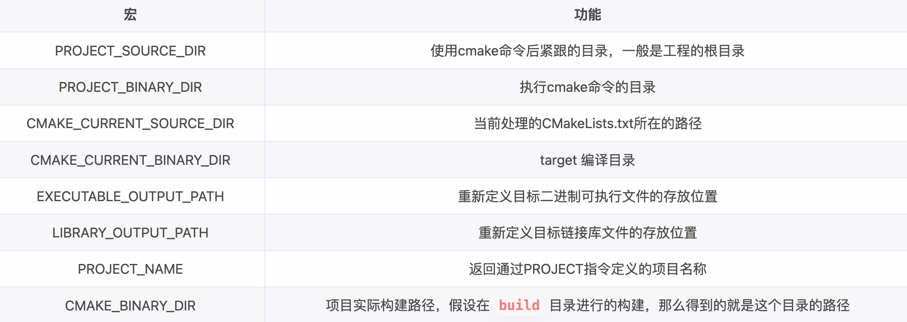

# cmake-using-handbook

## 几个最常见的初始配置

- 最简

  - ```cmake
    # CMakeLists.txt	使用的是注释符号
    
    cmake_minimum_required(VERSION 3.0.0)
    
    project(HelloWorld)
    
    add_executable(HelloWorld main.cpp)
    ```

- include/ src/ bin/

  - ```cmake
    #[[这是一个CMakeLists.txt	使用的是注释块]]
    
    cmake_minimum_require(VERSION 3.0.0)
    
    project(ModuleTest)
    
    set(CMAKE_EXPORT_COMPILE_COMMANDS ON)						# 设置默认生成compile_commands.json
    set(CMAKE_CXX_STANDARD 11)											# 设置使用cpp11标准
    																								# 相当于g++中的-std=c++11参数
    set(EXECUTABLE_OUTPUT_PATH ${PROJECT_SOURCE_DIR}/bin)	# 配置可执行程序的输出路径
    
    include_directories(${PROJECT_SOURCE_DIR}/include)
    
    aux_source_directory(${CMAKE_CURRENT_SOURCE_DIR}/src SRC_LIST)
    add_executable(app ${SRC_LIST})
    ```
  
- include/ src/ lib/

  - ```cmake
    cmake_minimum_require(VERSION 3.0.0)
    
    # 此处是各项宏配置，参考上一个案例
    
    set(EXECUTABLE_OUTPUT_PATH ${PROJECT_SOURCE_DIR}/lib)			# 动态库/可执行文件都可以通过EXECUTABLE_OUTPUT_PATH来设置输出路径
    set(LIBRARY_OUTPUT_PATH ${PROJECT_SOURCE_DIR}/lib)				# 静态库只能通过LIBRARY_OUTPUT_PATH来设置输出路径
    																													# 同时，该宏也能用于动态库
    
    include_directories(${PROJECT_SOURCE_DIR}/include)
    aux_source_directory(${CMAKE_CURRENT_SOURCE_DIR}/src SRC_LIST)
    
    add_library(applib SHARED ${SRC_LIST})
    # add_library(applib STATIC ${SRC_LIST})
    ```

    

- 动态库/静态库链接问题详见[]()

## CMake常用配置函数与宏

### 配置函数

- `cmake_minimum_required(VERSION 3.0.0)`：配置最低版本需求

- `project(HelloWorld)`：配置项目名称等信息

- `add_executable(app <src-files>)`：配置输出可执行文件

- `add_library(<name> STATIC/SHARED <src>)`：将\<src\>中的源文件以模式生成为\<name\>的库

- `set(VAR [VALUE])`：定义变量，多个源文件名称之间可用"空格"或";"隔开

- `aux_source_directory(<dir> <variable>)`：自动查找\<dir\>中的源文件并存储到\<variable\>

- `file(GLOB/GLOB_RECURSE VAR <dir>/*.cpp)`：将符合\<dir\>/*.cpp条件的文件存储到VAR中
  - GLOB：搜索指定目录下
  - GLOB_RECURSE：递归搜索指定目录下所有
  
- `include_directories(<headpath>)`：将\<headpath\>中的头文件进行添加

- `target_include_directories(<myLib> <PRIVATE|PUBLIC|INTERFACE> <head-files>)`：将\<head-files\>与\<myLib\>进行捆绑，当使用target_link_***的时候，就无需添加include。

  <p style="color:red;">下表举例为myApp需要使用myLib库的情形。</p>

  | 关键词    | 影响`myLib` | 影响`myApp` | 适用场景                               |
  | --------- | ----------- | ----------- | -------------------------------------- |
  | PRIVATE   | ✅ 有效      | ❌ 无效      | 只给 `myLib` 自己用                    |
  | INTERFACE | ❌ 无效      | ✅ 有效      | 只给 `myApp` 用（比如 header-only 库） |
  | PUBLIC    | ✅ 有效      | ✅ 有效      | `myLib` 和 `myApp` 都需要              |

  

- `link_libraries(<lib>)`：从\<lib\>链接全局库，使用第三方动态库则需要配合`link_directories(<path>)`使用

- `target_link_libraries(<myApp> <PRIVATE|PUBLIC|INTERFACE> <myLib(s)>)`：以模式将\<myLib(s)\>等库链接到\<myApp\>中，若使用的非target-myLib(s)则需要配合`link_directories(<path>)`指定相关头文件来使用。
  
  <p style="color:red;">下表举例为myApp需要使用myLib库，同时myLib需要使用extraLib库的情形。</p>
  
  | 关键词    | 影响`myLib`                   | 影响`myApp`                 | 使用场景                                                    |
  | --------- | ----------------------------- | --------------------------- | ----------------------------------------------------------- |
  | PRIVATE   | ✅ `myLib` 需要链接 `extraLib` | ❌ `myApp` 不继承 `extraLib` | 仅 `myLib` 依赖 `extraLib`，`myApp` 不需要                  |
  | INTERFACE | ❌ `myLib` 不需要 `extraLib`   | ✅ `myApp` 继承 `extraLib`   | `myLib` 只是声明 `extraLib`，但自己不使用（header-only 库） |
  | PUBLIC    | ✅ `myLib` 需要 `extraLib`     | ✅ `myApp` 也继承 `extraLib` | myLib` 和 `myApp` 都依赖 `extraLib                          |
  
  
  
- `link_directories(<path>)`：指定第三方库文件的存储目录

- `add_definitions(-D<DEF>)`：相当于*g++ test.c -D\<DEF\> -o app*

### 宏

- `CMAKE_CXX_STANDARD`：配置c++标准
- `EXECUTABLE_OUTPUT_PATH`：配置二进制文件输出路径，适用于可执行文件和动态库文件
- `LIBRARY_OUTPUT_PATH`：配置库文件输出路径，适用于动态库和静态库文件
- `PROJECT_SOURCE_DIR`：
- `CMAKE_CURRENT_SOURCE_DIR`：
- `CMAKE_EXPORT_COMPILE_COMMANDS`：是否生成clangd所需解析文件
- 

## 日志

日志为函数`message()`，使用形式如下：

```cmake
message([STATUS|WARNING|AUTHOR_WARNING|FATAL_ERROR|SEND_ERROR] "message to display" ...)
```

其中，包含多种消息层级

- （无）：重要消息
- STATUS：非重要消息
- WARNING：CMake警告，但会继续执行
- AUTHOR_WARNING：CMake警告(dev)，会继续执行
- SEND_ERROR：CMake错误，继续执行，但会跳过生成的步骤
- FATAL_ERROR：CMake错误，终止所有处理过程

## 变量操作

### 追加

- `set()`拼接：

  - ```cmake
    set(val1 ${val1} ${val2} ...)
    ```

- `list()`拼接：

  - ```cmake
    list(APPEND <list> <element> ...)
    ```

### 字符串移除

`list()`相关的各种操作。

## 附录

本文部分参考[爱编程的大丙](https://subingwen.cn/cmake/CMake-primer/)

